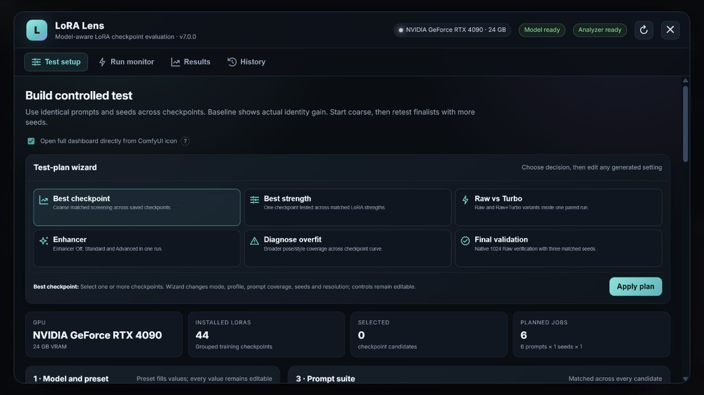

# ComfyUI LoRA Lens

**Stop guessing. Compare LoRA checkpoints with matched tests, face-aware ranking, and blind human voting.**



LoRA Lens replaces giant test graphs and subjective thumbnail hunting with a controlled evaluation dashboard inside ComfyUI. Every candidate receives the same prompt, seed, resolution, base model, and sampling settings. The result is a reproducible comparison rather than a collection of unrelated lucky generations.

## Highlights

- Categorized native adapters for Krea 2, FLUX.1, Z-Image, and Anima.
- Turbo, Schnell, Aesthetic, Raw, Base, and Dev variants remain separate and explicit.
- Universal API-workflow adapter for future models and custom-node pipelines.
- Checkpoint comparison, strength sweeps, Raw-versus-Turbo tests, and overfit diagnosis.
- Dual face-recognition ensemble: CVLFace ViT KP-RPE AdaFace plus InsightFace AntelopeV2.
- Dataset-wide reference centroid, top-k matching, quality diagnostics, and outlier rejection.
- Blind pairwise human tournaments with AI/human agreement reporting.
- Full-size arrow-key image viewer, ratings, run history, evidence ZIP export, and OneTrainer checkpoint watcher.
- No hidden subject words: the exact trigger and optional class are shown before generation.

## Requirements

- A current ComfyUI installation.
- Python 3.10–3.12 recommended.
- NVIDIA GPU strongly recommended for the face analyser; CPU inference is possible but slow.
- One or more LoRA files in `ComfyUI/models/loras`.
- The model files required by the selected native adapter, or a working ComfyUI API workflow.

The first analyser setup downloads several gigabytes of recognition weights. LoRA Lens shows installation status in the header and does not hide missing-model errors.

## Installation

### ComfyUI Manager

Search for **ComfyUI LoRA Lens** in ComfyUI Manager after it is listed in the registry, install it, and restart ComfyUI.

### Manual

Clone or download this repository into:

```text
ComfyUI/custom_nodes/ComfyUI-LoRA-Lens
```

Install Python dependencies with the Python environment used by ComfyUI:

```bash
python -m pip install -r ComfyUI/custom_nodes/ComfyUI-LoRA-Lens/requirements.txt
```

Restart ComfyUI. The analyser installer continues non-blocking in the background. See [Installation](docs/INSTALLATION.md) for Stability Matrix, portable Windows, Linux, and troubleshooting notes.

## Quick start

1. Click the **LoRA Lens** icon in ComfyUI's left navigation.
2. Choose a model category, family, and variant. Missing prerequisites are listed before a run can start.
3. Select the LoRA checkpoints to compare.
4. Enter the exact trigger token or phrase. An optional subject/class is never inserted unless you type it.
5. Review the resolved prompts, matched seeds, resolution, and sampling values.
6. Include a no-LoRA baseline, then create the run.
7. Review automatic identity ranking and complete the blind pairwise tournament.
8. Retest only the finalists with more seeds at the model's native resolution.

Do not compare models trained for different base architectures in one run. A fair checkpoint test keeps every variable fixed except the candidate LoRA.

## Model support

Native adapters currently cover:

| Family | Variants | Native workflow |
|---|---|---|
| Krea 2 | Raw, Turbo | Qwen3-VL encoder, Qwen Image VAE, Krea 2 loader |
| FLUX.1 | Dev, Schnell, Krea Dev | Dual CLIP/T5XXL, FLUX latent workflow |
| Z-Image | Base, Turbo | Qwen 3 4B, AuraFlow model sampling, SD3 latent |
| Anima | Base, Aesthetic, Turbo | Qwen 3 0.6B, Qwen Image VAE, Anima sampling defaults |

This list is not the compatibility ceiling. Use **Import any API workflow** for SD 1.5, SDXL, Pony, Illustrious, custom quantizations, GGUF loaders, or any new model with a working ComfyUI graph. See [Model adapters](docs/MODEL_ADAPTERS.md).

## How ranking works

The automatic analyser compares each detected candidate face with a cleaned set of reference embeddings. It combines a quality-weighted identity centroid with the strongest individual reference matches, then ensembles two independent recognition systems. Face quality changes confidence; it does not reward an image merely for being sharper or more frontal.

Automatic scores are evidence, not truth. The blind tournament intentionally hides candidate identity so your preference can be compared with the model ranking instead of being influenced by filenames or steps.

## Privacy

Reference images, LoRAs, prompts, scores, and generated images stay in your local ComfyUI folders. The plugin does not upload them. Model weights are downloaded from their documented upstream repositories during analyser setup.

## Documentation

- [Installation and prerequisites](docs/INSTALLATION.md)
- [Using LoRA Lens](docs/USAGE.md)
- [Native and custom model adapters](docs/MODEL_ADAPTERS.md)
- [Troubleshooting](docs/TROUBLESHOOTING.md)
- [Contributing](CONTRIBUTING.md)
- [Changelog](CHANGELOG.md)

## License

LoRA Lens code is released under the [MIT License](LICENSE). Model weights and base models retain their own licenses; some, including Anima or FLUX variants, may restrict commercial use. Check each upstream model card before distribution or commercial use.

